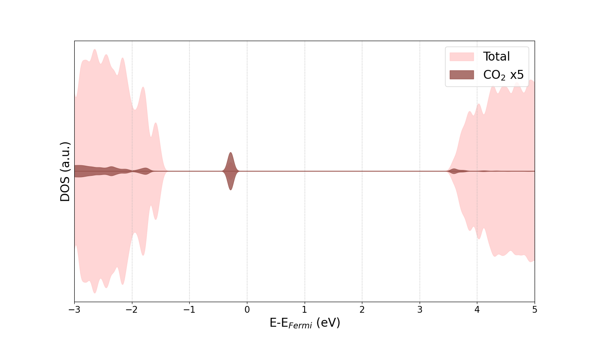

# pydos

# Description
Based on pydos developed by Qijing Zheng.
<br>This program is edited to export DOS data in csv format (pydos_csv.py) and plot it (pydos_plot.py).
<br>[pydos original version](https://github.com/QijingZheng/pyband)

# Changes to the pydos Code

Add the following code after the section "def generateDos(opts):" in pydos.

```
import pandas as pd

def save_dos_to_csv(xen, tdos, pdos, filename="dos_data.csv"):
    # xen (energy values) will be the first column
    data = {"Energy": xen}

    # Adding total DOS data to the dataframe
    for i in range(tdos.shape[1]):
        data[f"Total DOS (Spin {i+1})"] = tdos[:, i]

    # Adding PDOS data to the dataframe
    for i, pdos_data in enumerate(pdos):
        for j in range(pdos_data.shape[1]):
            data[f"PDOS {i+1} (Spin {j+1})"] = pdos_data[:, j]

    # Creating a DataFrame and saving it to a CSV file
    df = pd.DataFrame(data)
    df.to_csv(filename, index=False)
    return filename
```
Add this code to the last line of the entire pydos.

```
xen, tdos, pdos = generateDos(opts)
filename = save_dos_to_csv(xen, tdos, pdos, "dos_data.csv")
```

# Plot DOS

Use pydos (here pydos_csv.py) modified as above.
<br>Here is an example of plotting PDOS and Total DOS using "-p" option.
<br>Options such as "-x" and "-z" are meaningless when exporting to csv.

```
pydos_csv.py -p '128 129 194'
```
Next, edit pydos_plot.py.

Enter Fermi Energy obtained from OUTCAR or other sources.
```
Efermi = -1.7958333333
```
Enter the display range for the X-axis (Energy) or Y-axis (DOS).

```
x_display_range = (-3, 5)
y_display_range = (-120, 120)
```
The PDOS of small molecules such as CO2 is very small, so multiply by an arbitrary number to make the PDOS easier to see.
```
pdos1_scale_factor = 5
```
Enter a color name, such as brown or blue, or a color code.
<br>The DOS will appear filled in the color you specify.
<br>To display two or more PDOS, append the same format, e.g., 'PDOS 2': 'color_name'.
```
color_settings = {
    'Total DOS': '#FFCCCC',
    'PDOS 1': '#98514B',
}
```
Set 'legend', if you are plotting more than one PDOS, append the same format, e.g. 'PDOS 2 (Spin 1)': 'others'.
```
legend_names = {
    'Total DOS (Spin 1)': 'Total',
    'PDOS 1 (Spin 1)': 'CO$_2$ x5'
}
```




